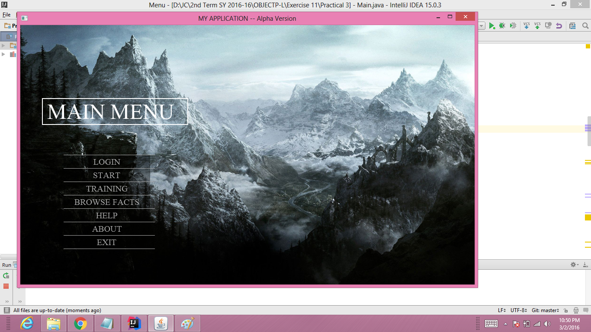

# Menu.

##Main
~~~
package ph.edu.dlsu;

import javafx.application.Application;
import javafx.application.Platform;
import javafx.event.ActionEvent;
import javafx.event.EventHandler;
import javafx.geometry.Pos;
import javafx.scene.Parent;
import javafx.scene.Scene;
import javafx.scene.image.Image;
import javafx.scene.image.ImageView;
import javafx.scene.layout.BorderPane;
import javafx.scene.layout.StackPane;
import javafx.scene.layout.VBox;
import javafx.scene.paint.Color;
import javafx.scene.paint.CycleMethod;
import javafx.scene.paint.LinearGradient;
import javafx.scene.paint.Stop;
import javafx.scene.shape.Line;
import javafx.scene.shape.Rectangle;
import javafx.scene.text.Font;
import javafx.scene.text.FontWeight;
import javafx.scene.text.Text;
import javafx.stage.Stage;

import java.io.IOException;
import java.io.InputStream;
import java.nio.file.Files;
import java.nio.file.Paths;

public class Main extends Application {

    private static final String WINDOW_TITLE = "MY APPLICATION -- Alpha Version";
    private static final String MENU_TITLE = " MAIN MENU";

    private static final int WINDOW_WIDTH = 1050;
    private static final int WINDOW_HEIGHT = 600;

    public static void main(String[] args) {
        // Start the JavaFX application by calling launch().
        launch(args);
    }

    @Override
    public void start(Stage primaryStage) throws Exception {
        Scene scene = new Scene(createContent());
        primaryStage.setTitle(WINDOW_TITLE);
        primaryStage.setScene(scene);
        primaryStage.show();
    }

    // Create content for the scene
    private Parent createContent() {
        final BorderPane rootNode = new BorderPane();

        rootNode.setPrefSize(WINDOW_WIDTH, WINDOW_HEIGHT);

        try (InputStream is = Files.newInputStream(Paths.get("res/skyrim.jpg"))) {
            ImageView img = new ImageView(new Image(is));
            img.setFitWidth(WINDOW_WIDTH);
            img.setFitHeight(WINDOW_HEIGHT);
            rootNode.getChildren().add(img);
        } catch (IOException e) {
            System.out.println("Failed to load image!");
        }

        Title title = new Title(MENU_TITLE);
        title.setTranslateX(50);
        title.setTranslateY(200);

        final MenuItem login = new MenuItem("LOGIN");
        final MenuItem startBse = new MenuItem("START");
        final MenuItem training = new MenuItem("TRAINING");
        final MenuItem browse = new MenuItem("BROWSE FACTS");
        final MenuItem help = new MenuItem("HELP");
        final MenuItem about = new MenuItem("ABOUT");
        final MenuItem exit = new MenuItem("EXIT");

        exit.setOnMouseClicked(event -> Platform.exit());

        startBse.setOnMouseClicked(event -> {

            new App();
            App.main(null);

        });

        MenuBox vbox = new MenuBox(
                login,
                startBse,
                training,
                browse,
                help,
                about,
                exit);

        vbox.setTranslateX(100);
        vbox.setTranslateY(300);

        rootNode.getChildren().addAll(title, vbox);

        return rootNode;

    }

    private void createMenuHandler() {
        // Create one event handler that will handle menu action events.
        EventHandler<ActionEvent> MEHandler =
                new EventHandler<ActionEvent>() {
                    public void handle(ActionEvent ae) {
                        // String name = ((MenuItem)ae.getTarget()).getT;
                        // If Exit is chosen, the program is terminated.
//                        if (name.equals("Exit")) Platform.exit();
//                        response.setText(name + " selected");
                    }
                };

        // Set action event handlers for the menu items.
    }

    private static class Title extends StackPane {
        public Title(String name) {
            Rectangle bg = new Rectangle(336, 60);
            bg.setStroke(Color.WHITE);
            bg.setStrokeWidth(2);
            bg.setFill(null);

            Text text = new Text(name);
            text.setFill(Color.WHITE);
            text.setFont(Font.font("Times New Roman", FontWeight.SEMI_BOLD, 50));

            setAlignment(Pos.CENTER_LEFT);
            getChildren().addAll(bg, text);
        }
    }

    private static class MenuBox extends VBox {
        public MenuBox(MenuItem... items) {
            getChildren().add(createSeparator());

            for (MenuItem item : items) {
                getChildren().addAll(item, createSeparator());
            }
        }

        private Line createSeparator() {
            Line sep = new Line();
            sep.setEndX(210);
            sep.setStroke(Color.DARKGREY);
            return sep;
        }

    }

    private static class MenuItem extends StackPane {
        public MenuItem(String name) {
            LinearGradient gradient = new LinearGradient(0, 0, 1, 0, true, CycleMethod.NO_CYCLE, new Stop[]{
                    new Stop(0, Color.DARKOLIVEGREEN),
                    new Stop(0.1, Color.BLACK),
                    new Stop(0.9, Color.BLACK),
                    new Stop(1, Color.DARKOLIVEGREEN)

            });

            Rectangle bg = new Rectangle(200, 30);
            bg.setOpacity(0.4);

            Text text = new Text(name);
            text.setFill(Color.DARKGREY);
            text.setFont(Font.font("Times New Roman", FontWeight.SEMI_BOLD, 20));

            setAlignment(Pos.CENTER);
            getChildren().addAll(bg, text);
            setOnMouseEntered(event -> {
                bg.setFill(gradient);
                text.setFill(Color.WHITE);

            });

            setOnMouseExited(event -> {
                bg.setFill(Color.BLACK);
                text.setFill(Color.DARKGREY);
            });
            setOnMousePressed(event -> {
                bg.setFill(Color.DARKGREEN);

            });

            setOnMouseReleased(event -> {
                bg.setFill(gradient);
            });

        }
    }
}
~~~

##App
~~~
package ph.edu.dlsu;

import org.opencv.core.Core;
import org.opencv.core.Mat;
import org.opencv.videoio.VideoCapture;
import org.opencv.videoio.Videoio;
import ph.edu.dlsu.utils.ImageProcessor;

import javax.swing.*;
import java.awt.*;

public class App
{
    static{ System.loadLibrary(Core.NATIVE_LIBRARY_NAME);
    }

    private JFrame frame;
    private JLabel imageLabel;

    public static void main(String[] args) {
        App app = new App();
        app.initGUI();
        app.runMainLoop(args);
    }

    private void initGUI() {
        frame = new JFrame("Camera Input Example");
        frame.setDefaultCloseOperation(JFrame.EXIT_ON_CLOSE);
        frame.setSize(400,400);
        imageLabel = new JLabel();
        frame.add(imageLabel);
        frame.setVisible(true);
    }

    private void runMainLoop(String[] args) {
        ImageProcessor imageProcessor = new ImageProcessor();
        Mat webcamMatImage = new Mat();
        Image tempImage;
        VideoCapture capture = new VideoCapture(0);

        capture.set(Videoio.CAP_PROP_FRAME_WIDTH,320);
        capture.set(Videoio.CAP_PROP_FRAME_HEIGHT,240);

        if( capture.isOpened()){
            while (true){
                capture.read(webcamMatImage);
                if( !webcamMatImage.empty() ){
                    tempImage= imageProcessor.toBufferedImage(webcamMatImage);
                    ImageIcon imageIcon = new ImageIcon(tempImage, "Captured video");
                    imageLabel.setIcon(imageIcon);
                    frame.pack();  //this will resize the window to fit the image
                }
                else{
                    System.out.println(" -- Frame not captured -- Break!");
                    break;
                }
            }
        }
        else{
            System.out.println("Couldn't open capture.");
        }

    }
}

~~~

##ImageProcessor
~~~
package ph.edu.dlsu.utils;

import org.opencv.core.Mat;

import java.awt.image.BufferedImage;
import java.awt.image.DataBufferByte;

public class ImageProcessor {

    public BufferedImage toBufferedImage(Mat matrix){
        int type = BufferedImage.TYPE_BYTE_GRAY;
        if ( matrix.channels() > 1 ) {
            type = BufferedImage.TYPE_3BYTE_BGR;
        }
        int bufferSize = matrix.channels()*matrix.cols()*matrix.rows();
        byte [] buffer = new byte[bufferSize];
        matrix.get(0,0,buffer); // get all the pixels
        BufferedImage image = new BufferedImage(matrix.cols(),matrix.rows(), type);
        final byte[] targetPixels = ((DataBufferByte) image.getRaster().getDataBuffer()).getData();
        System.arraycopy(buffer, 0, targetPixels, 0, buffer.length);
        return image;
    }

}

~~~
